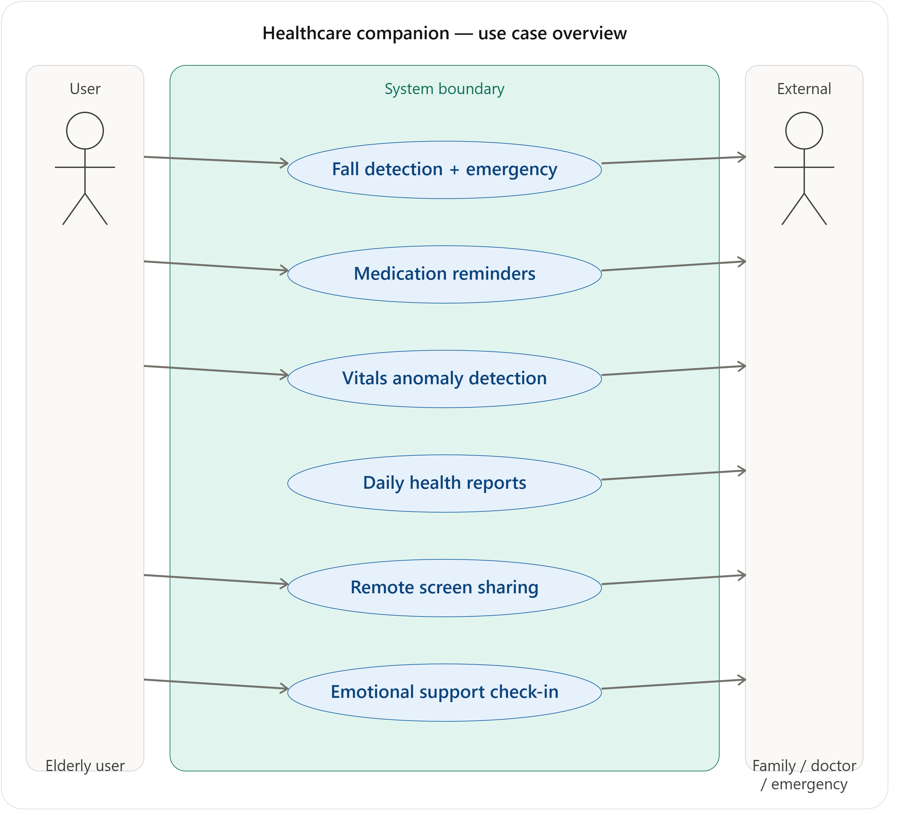
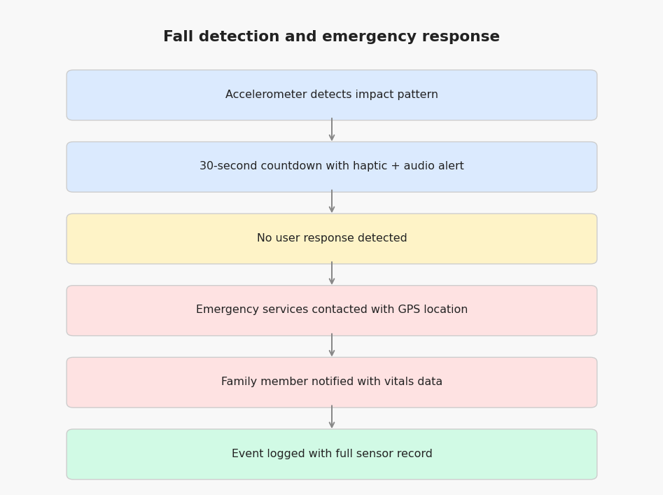
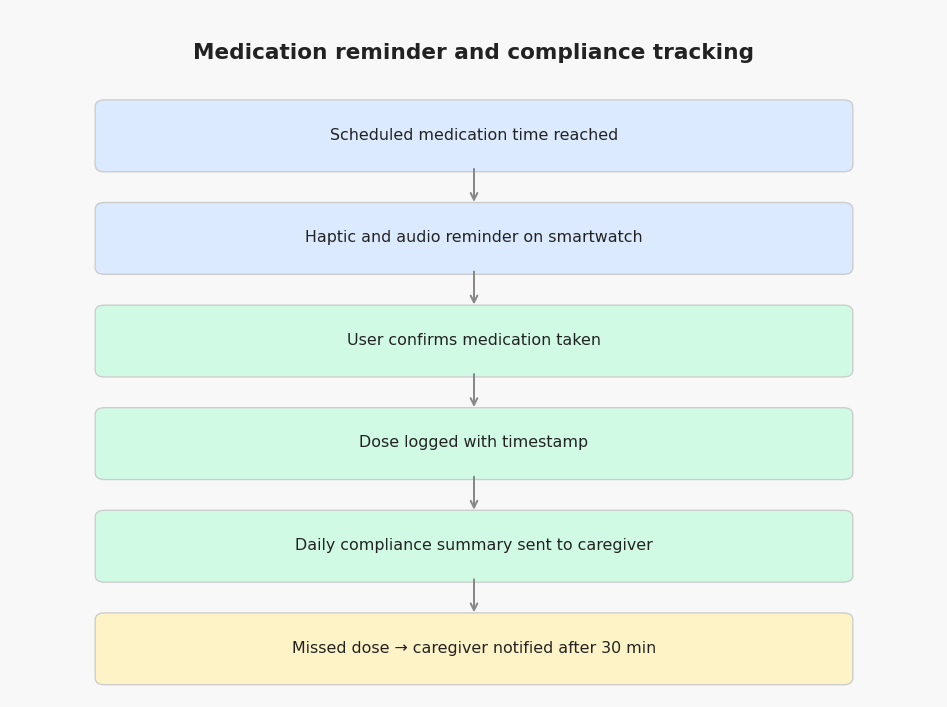
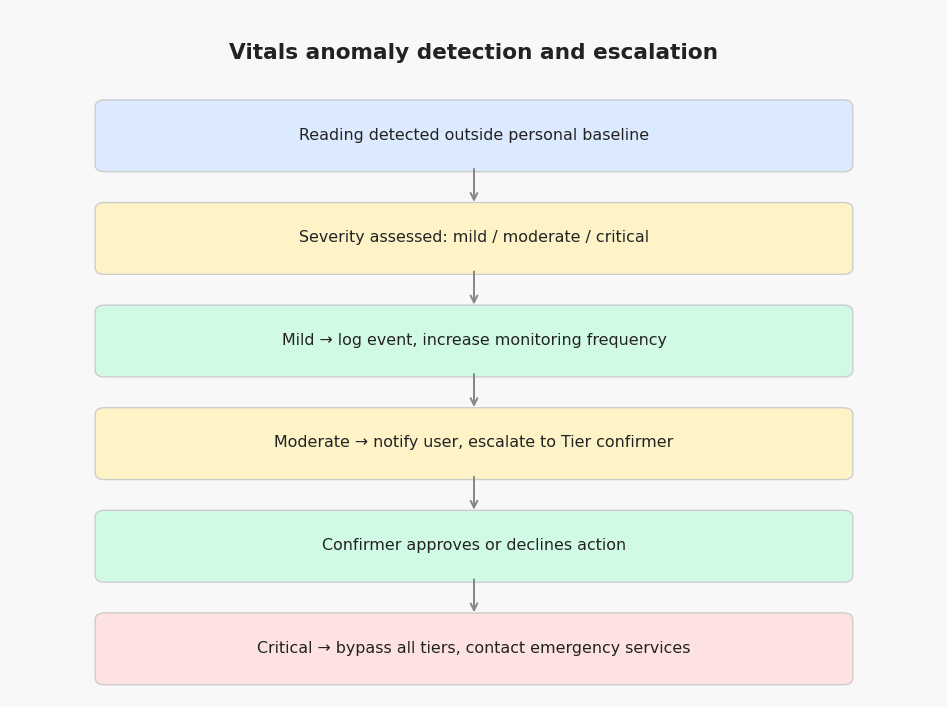
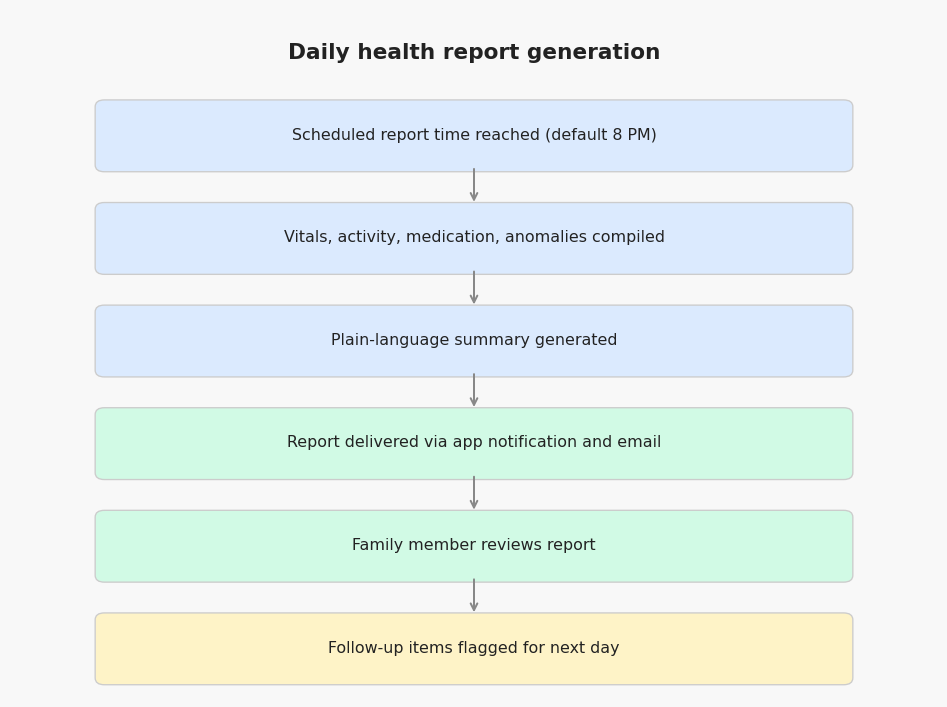
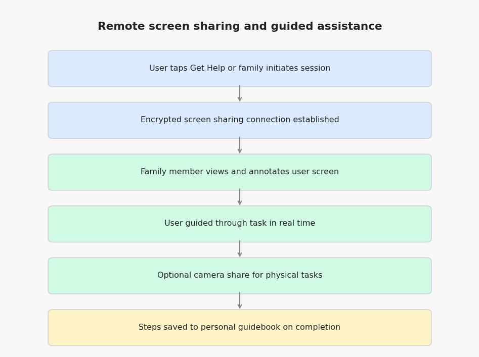
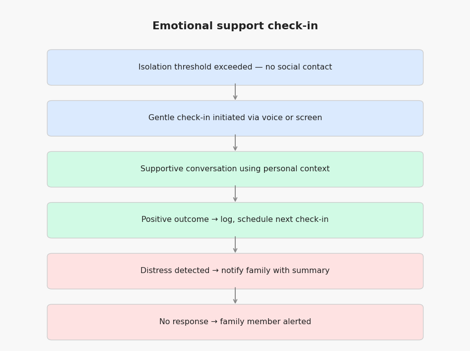

# Use Cases

Five core use case scenarios covering the system's most critical interaction flows. Each scenario includes a formal use case table, activity flow, and exception handling.

---

## Use Case 1: Automated Fall Detection and Emergency Response

| Field | Detail |
|---|---|
| **Use Case Name** | Automated fall detection and emergency contact |
| **Scenario** | User experiences a fall while home alone |
| **Triggering Event** | Accelerometer and gyroscope detect impact pattern consistent with fall |
| **Brief Description** | System detects fall, attempts to contact user, escalates to emergency services if no response |
| **Actors** | User, System, Emergency Services, Designated Family Member |
| **Preconditions** | User is wearing smartwatch; emergency contacts configured; location services enabled |
| **Postconditions** | Emergency services contacted with user location; family member notified; event logged |

**Flow of Activities:**

| Actor | System |
|---|---|
| User falls and becomes unresponsive | Detects impact via accelerometer and gyroscope |
| | Triggers 30-second countdown with audible and haptic alert |
| User does not respond | Contacts emergency services automatically with GPS coordinates |
| | Sends real-time location and recent vitals data to designated family member |
| | Logs complete event record with sensor data and timestamps |
| Emergency services arrive | System continues transmitting location until manually dismissed |

**Exception Events:**
- GPS signal unavailable — system uses last known location and flags uncertainty to emergency services
- User responds during countdown — system cancels escalation, logs near-miss event, notifies family that alert was triggered and resolved

---

## Use Case 2: Medication Reminder and Compliance Tracking

| Field | Detail |
|---|---|
| **Use Case Name** | Medication reminder and compliance logging |
| **Scenario** | User receives reminder for scheduled medication |
| **Triggering Event** | Scheduled medication time reached |
| **Brief Description** | System delivers reminder, logs user response, alerts caregiver if medication missed |
| **Actors** | User, System, Designated Family Member or Caregiver |
| **Preconditions** | Medication schedule configured by user, physician, or family member; smartwatch paired and worn |
| **Postconditions** | Medication event logged as taken, skipped, or unresponsive; caregiver alerted if threshold of missed doses exceeded |

**Flow of Activities:**

| Actor | System |
|---|---|
| | Delivers haptic and audio reminder on smartwatch |
| User confirms medication taken | Logs confirmed dose with timestamp |
| | Updates compliance record |
| | Sends daily compliance summary to caregiver |

**Exception Events:**
- User does not respond within 15 minutes — secondary reminder delivered
- User does not respond within 30 minutes — designated contact notified
- User reports side effect — event logged and flagged for physician review at next check-in

---

## Use Case 3: Vital Signs Anomaly Detection and Tiered Escalation

| Field | Detail |
|---|---|
| **Use Case Name** | Personal baseline anomaly detection and tiered escalation |
| **Scenario** | User's heart rate deviates significantly from their personal baseline |
| **Triggering Event** | Continuous monitoring detects reading outside user's established normal range |
| **Brief Description** | System detects anomaly against personal baseline, assesses severity, escalates through appropriate tier |
| **Actors** | User, System, Tier 1/2/3 Confirmer |
| **Preconditions** | 30-day baseline calibration period complete; escalation tier configured |
| **Postconditions** | Anomaly logged; appropriate escalation action taken; event visible in caregiver dashboard |

**Flow of Activities:**

| Actor | System |
|---|---|
| | Detects reading outside personal baseline range |
| | Assesses deviation severity: mild / moderate / critical |
| | Mild: logs event, increases monitoring frequency |
| | Moderate: notifies user, escalates to Tier confirmer in plain language |
| Tier confirmer reviews notification | Approves, modifies, or declines recommended action |
| System executes approved action | Logs outcome and confirmer response |
| | Critical: bypasses confirmation, contacts emergency services immediately |

**Exception Events:**
- Confirmer unavailable — system escalates to next tier automatically after 10-minute timeout
- Sensor reading flagged as low confidence (motion artifact) — system requests user to remain still and retakes reading before escalating

---

## Use Case 4: Daily Health Report and Caregiver Dashboard

| Field | Detail |
|---|---|
| **Use Case Name** | Automated daily health summary for caregiver |
| **Scenario** | End of day health report generated and delivered to family |
| **Triggering Event** | Scheduled daily report time (default: 8:00 PM) |
| **Brief Description** | System compiles day's health data into readable summary and delivers to caregiver contacts |
| **Actors** | System, Designated Family Member or Caregiver |
| **Preconditions** | At least one caregiver contact configured; data collection active throughout the day |
| **Postconditions** | Report delivered and logged; caregiver can access detailed data if needed |

**Flow of Activities:**

| Actor | System |
|---|---|
| | Compiles vitals summary, activity data, medication compliance, and anomaly events |
| | Generates plain-language summary accessible to non-clinical readers |
| | Delivers report via app notification and optional email |
| Family member reviews report | System logs report as delivered and read |
| Family member requests more detail | System provides full sensor data and event log for the day |
| | Flags items requiring follow-up in next day's monitoring priorities |

**Exception Events:**
- Device not worn for significant portion of day — report notes data gap, alerts family to check in directly
- Anomaly event occurred during day — report highlights event prominently regardless of resolution status

---

## Use Case 5: Remote Assistance and Screen Sharing

| Field | Detail |
|---|---|
| **Use Case Name** | Remote screen sharing and guided assistance |
| **Scenario** | User needs help navigating a task on their phone and contacts family for support |
| **Triggering Event** | User taps "Get Help" button or family member initiates remote session |
| **Brief Description** | Family member joins a secure screen sharing session to guide user through a task in real time, with optional camera sharing for physical tasks |
| **Actors** | User, Family Member, System |
| **Preconditions** | Family member is a registered trusted contact; both devices have internet connection |
| **Postconditions** | Task completed; session logged with duration; optional instruction saved to personal guidebook |

**Flow of Activities:**

| Actor | System |
|---|---|
| User taps Get Help | Sends notification to designated family contacts |
| Family member accepts session | Establishes encrypted screen sharing connection |
| Family member views user's screen | Displays user screen with annotation tools |
| Family member guides user through task | User follows instructions in real time |
| | Optional: family member activates camera share for physical tasks |
| Task completed | Session ends; family member offered option to save steps as guidebook entry |
| | Saved entry accessible to user via AI voice readback at any time |

**Exception Events:**
- No family member responds within 5 minutes — system offers to connect user with next contact on list
- Connection quality poor — system falls back to voice call with screen description mode
- User becomes distressed during session — system logs distress indicators and flags for follow-up

---

## Use Case 6: Emotional Support Check-In

| Field | Detail |
|---|---|
| **Use Case Name** | AI emotional support check-in during isolation period |
| **Scenario** | System detects extended period of low activity and no social interaction |
| **Triggering Event** | Activity and communication data indicates user has had no social interaction beyond configurable threshold |
| **Brief Description** | System initiates supportive conversation, assesses user wellbeing, escalates to human contact if distress detected |
| **Actors** | User, System, Designated Family Member |
| **Preconditions** | Emotional support mode enabled; user communication history available; family contact configured |
| **Postconditions** | Wellbeing check logged; family notified of outcome; escalation triggered if distress detected |

**Flow of Activities:**

| Actor | System |
|---|---|
| | Detects isolation threshold exceeded |
| | Initiates gentle check-in via voice or screen prompt |
| User engages with check-in | Conducts supportive conversation using stored personal context and history |
| | Monitors conversation for distress indicators throughout |
| | Positive or neutral outcome: logs interaction, schedules next check-in |
| | Distress detected: notifies designated family member with conversation summary |
| | No response to check-in: notifies family member that user has not responded |

**Exception Events:**
- User declines interaction — system respects refusal, logs it, notifies family if refusals exceed configurable threshold
- User expresses medical complaint during conversation — system flags for Tier escalation in addition to emotional support response
